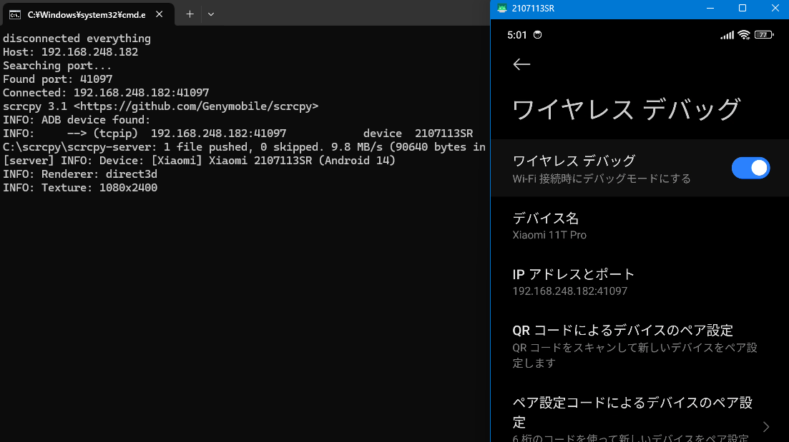

## できること

スマホをキッチンや他の部屋に置いてきてもワンクリックでPCにミラーリング、操作ができる。通常は画面ロックや再起動でワイヤレスデバッグのポート番号が変更されるが、自動検出してADB接続。

## 環境構築


1. **必要なツールのインストール**  
    - Node.js
    - namp
    - Scrcpy

2. **無線接続の設定** 

    - スマホとPCを同じWi-Fiネットワークに接続
    - AndroidスマホのIPアドレスを固定化

3. **スクリプトの作成** 

    [こちらの記事](https://zenn.dev/come25136/articles/2884f49de5a751#%E4%BD%9C%E3%81%A3%E3%81%9F%E3%83%84%E3%83%BC%E3%83%AB)に記載されているjsソースコードをadb_auto_connect.jsとして任意のパスに保存。（後ほど使用） 

4. **バッチファイルの作成**

```batch
@echo off

REM adb_auto_connect.jsのフルパスを指定
set SCRIPT_PATH=<adb_auto_connect.jsのフルパス>

REM 引数を指定（ここでIPアドレスを渡す）
set IP_ADDRESS=<固定したIPアドレス>

REM 一旦切断　重複回避
adb disconnect

REM スクリプトを実行 引数にIPアドレス
node "%SCRIPT_PATH%" %IP_ADDRESS%

REM scrcpyを実行
scrcpy -e --max-fps=60 --audio-bit-rate=128K --video-bit-rate=20M

REM
pause
```

パスとIPアドレスを指定して`start_auto_scrcpy.bat`のような名前で保存。

5. **バッチファイルをタスクバーに固定**

一旦ショートカットを作成し、以下のようにリンク先部分のパスを変更。

```
cmd /c "<バッチファイルのフルパス>"
```

タスクバーにドラッグアンドドロップ

## 動作の様子




## 参考にした記事

- [Scrcpy公式ドキュメント](https://github.com/Genymobile/scrcpy)
- [Zenn - Androidワイヤレスデバッグをちょっと便利にするツール](https://zenn.dev/come25136/articles/2884f49de5a751)
- [Qiita - [忘備録] batファイルをタスクバーに固定したい](https://qiita.com/GeneLab_999/items/2ea97f56a3db10ff6016)