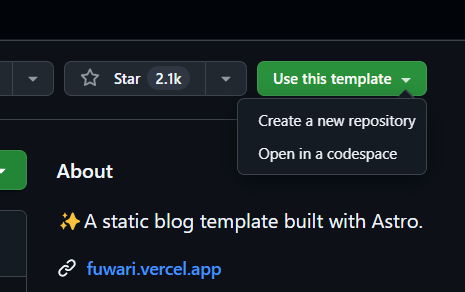

## はじめに

この記事では、完全無料で簡単にMarkdownブログを構築する方法を紹介します。技術スタックは、[Astro](https://astro.build/)と[Tailwind CSS](https://tailwindcss.com/)です。テンプレートを活用することで、最短10分ほどでブログを立ち上げることができます。

## なぜAstroなのか

- コンポーネントベースを採用、再利用可能なUI
- 高速なパフォーマンス
- React、Vue、Svelteなどのフレームワークを組み合わせて開発できる

など。

:::note
詳しくはAstro公式[Astroを選ぶ理由](https://docs.astro.build/ja/concepts/why-astro/)を参照。
:::

## 必要なもの

- GitHub アカウント
- git操作の知識
- Node.js と npm がインストールされた環境(テンプレートによってpnpmを使うことも)


## ステップ 1: テンプレートの使用

まずは当サイトで採用しているAstroテンプレート、[fuwari](https://github.com/saicaca/fuwari)を開きUse this template、Create a new repositoryします。リポジトリ名などを指定して次に進みます。




## ステップ 2: 依存関係のインストール

次に、プロジェクトの依存関係をインストールします。

```bash
pnpm install
pnpm add sharp
```

## ステップ 3: 開発サーバーの起動

以下のコマンドで開発サーバーを起動し、ローカル環境で確認します。

```bash
pnpm dev
```

ブラウザで `http://localhost:4321/<リポジトリ名>` にアクセスすると、テンプレートが正しく動作していることを確認できます。

この状態で `src\posts\guide\index.md` などを変更してみると即時に反映されるかと思います。

## おわりに

これで基本的なセットアップ、ローカルでの環境構築は完了です。


実際のデプロイは[AstroサイトをGitHub Pagesにデプロイする](https://docs.astro.build/ja/guides/deploy/github/)を参照してください。